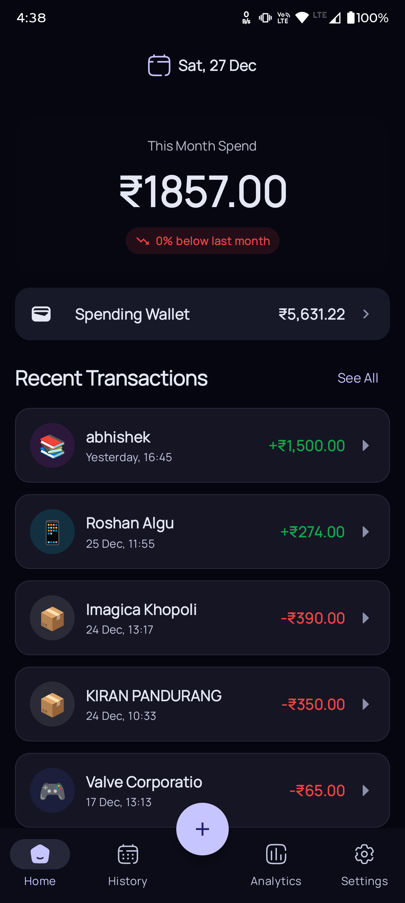
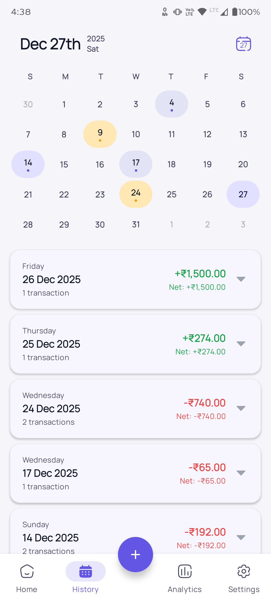
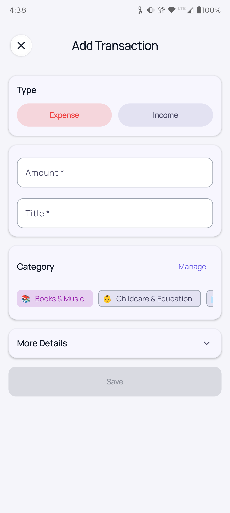
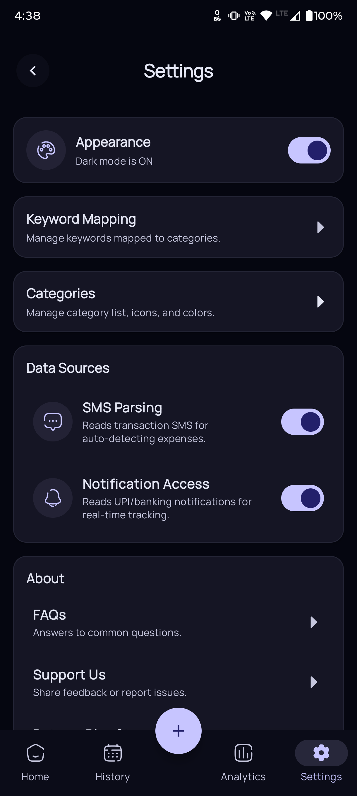
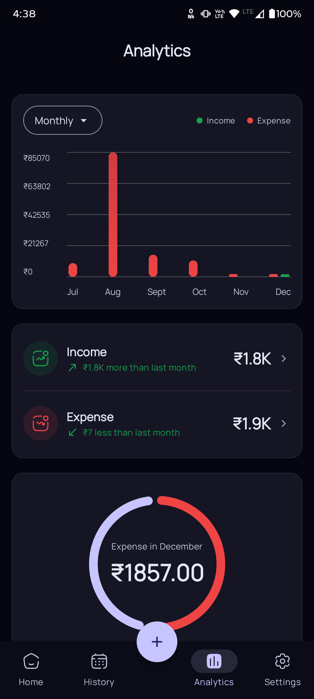

---

<p align="center">
  
</p>

<h1 align="center">Cashio</h1>

<p align="center">
  A modern, privacy-first personal finance tracker built with Jetpack Compose.
</p>

<p align="center">
  
  
  
  
  
</p>

---

## 💸 Smart Expense & Income Tracker for Android

Cashio is a **production-grade personal finance app** built with **Jetpack Compose** and **clean
architecture principles**.
It focuses on **clarity, speed, and thoughtful UX**, enabling users to track expenses and income
with calendar-based insights, meaningful visuals, and smooth interactions.

> Designed and built as a **real product**, not a tutorial or demo app.

---

## 📱 App Screens

<p align="center">
  
  
  
  
  
</p>

---

## 🧠 Product Philosophy

Cashio was built to address a common weakness in many expense trackers:

> They show numbers, but don’t help users *understand* their spending.

Core design principles:

* **Calendar-first exploration** instead of endless lists
* **Visual spending intensity** via heatmaps, not raw totals
* **Fast, low-friction data entry**
* **Local-first and privacy-respecting by default**

Every screen is designed to answer:

> *What did I spend, when, and why?*

---

## ✨ Key Features

### 📊 Smart Transaction Tracking

* Add **expenses & income** with categories, notes, date & time
* Edit transactions seamlessly
* Clear validation and error handling

### 🗓️ Calendar-Driven History

* Monthly **calendar heatmap** showing spending intensity
* Tap any date to instantly filter transactions
* Day-grouped expandable transaction cards

### 📈 Analytics & Insights

* Monthly spend overview
* Category-wise breakdown
* Net income vs expense indicators

### 🎨 Polished UX & Motion

* Compose animations for hierarchy and feedback
* Haptic feedback for meaningful actions
* Material 3 styling with semantic colors

### 🔐 Privacy-First

* Local-first data handling
* No ads, no tracking SDKs
* Designed with Play Store policy compliance in mind

---

## 🧱 Architecture Overview

Cashio follows **Clean Architecture + MVVM** with strict separation of concerns.

```
data/
 ├── local/
 ├── repository/
domain/
 ├── model/
 ├── usecase/
presentation/
 ├── add/
 ├── history/
 ├── analytics/
 ├── settings/
 └── common/
ui/
 ├── components/
 ├── cards/
 ├── navigation/
 └── theme/
```

### Architectural Principles

* **Single source of truth** via immutable UI state
* **Unidirectional data flow**
* Business logic isolated in **UseCases**
* UI is fully **state-driven**

---

## ⚙️ Engineering Highlights

### State Management

* No UI-side sorting or filtering
* ViewModels own all transformation logic
* Predictable, testable state flows

### Calendar Heatmap (Advanced)

* **Dynamic percentile-based intensity**
* Automatically adapts to individual spending habits
* Avoids hardcoded thresholds that break across users

### Performance

* Pre-sorted day groups computed once
* Lazy rendering only where data size demands it
* Zero recomposition loops from derived UI logic

### UX Engineering

* Motion used to communicate hierarchy, not decoration
* Haptics reinforce intent
* Animations never block user input

---

## 🚀 Status

Feature-complete core flows; polishing analytics and performance; preparing for Play Store
compliance.

---

## 🧪 Testing Strategy

* ViewModel logic is isolated and testable
* UI driven by deterministic state
* Defensive error handling for all data flows

(Unit & UI tests planned as a next milestone.)

---

## 📦 Installation

```bash
git clone https://github.com/your-username/cashio.git
```

Open in **Android Studio Hedgehog+**, sync Gradle, and run on an emulator or device.

---

## 🤝 Contributing

This project is currently maintained by a single developer.

Thoughtful discussions, suggestions, and PRs are welcome — especially around:

* Analytics insights
* Performance optimizations
* Accessibility improvements

---

## 📌 Vision

Cashio aims to be:

> **A fast, beautiful, and trustworthy personal finance companion**,
> built with the same rigor and care as professional fintech products.

---
